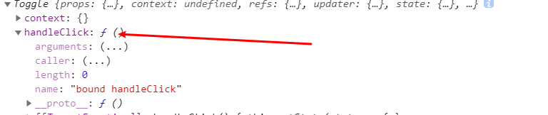
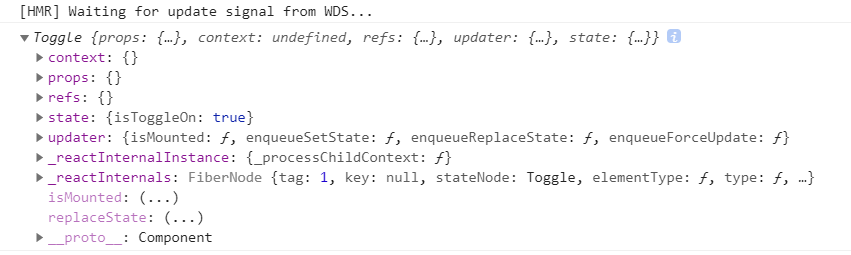
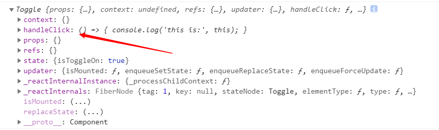

#### 最近在学React，自己对事件处理函数绑定this的疑难问题，所以写下来记录
#### 首先是官网代码
``` js
class Toggle extends React.Component {
  constructor(props) {
    super(props);
    this.state = {isToggleOn: true};

    // 为了在回调中使用 `this`，这个绑定是必不可少的
    this.handleClick = this.handleClick.bind(this);
    console.log(this); //输出this
  }

  handleClick() {
    this.setState(state => ({
      isToggleOn: !state.isToggleOn
    }));
  }

  render() {
    return (
      <button onClick={this.handleClick}>
        {this.state.isToggleOn ? 'ON' : 'OFF'}
      </button>
    );
  }
}

ReactDOM.render(
  <Toggle />,
  document.getElementById('root')
);
```
#### 1.在构造函数中绑定
- 这个绑定最终将方法绑定在this对象中，在控制台输出就可以明显看到。


#### 2.如果不把方法显示的绑定在this对象里，那也可以在回调中进行绑定。
``` js
 render() {
    return (
      <button onClick={this.handleClick.bind(this)}> //修改绑定方式
        {this.state.isToggleOn ? 'ON' : 'OFF'}
      </button>
    );
  }
```
- 没出现任何错误，状态切换也没有问题，再次打印this，没有发现handleClick()方法，也就是没有把方法添加到this对象里面



####  3.public class fields 语法(官网提供的另一种绑定方式)
 ```js
 // 此语法确保 `handleClick` 内的 `this` 已被绑定。
  // 注意: 这是 *实验性* 语法。
  handleClick = () => {
    console.log('this is:', this);
  }
 ```
 - 这种绑定方式也会直接将handleClick()直接添加到this对象里

 

#### 4.在回调中使用箭头函数
```js
class LoggingButton extends React.Component {
  handleClick() {
    console.log('this is:', this);
  }

  render() {
    // 此语法确保 `handleClick` 内的 `this` 已被绑定。
    return (
      <button onClick={() => this.handleClick()}>
        Click me
      </button>
    );
  }
}
```
- 同样，方法不会添加到this对象中

#### 5.在回调中使用匿名函数
```js
  render() {
    // 此语法确保 `handleClick` 内的 `this` 已被绑定。
    return (
      <button onClick={function(){this.handleClick()}.bind(this)}> //还是要绑定this
        Click me
      </button>
    );
  }
```
- 同样，方法不会添加到this对象中

### 个人理解
1. 在构造函数绑定this，使用public class fields 语法，方法才会显示的绑定在this对象里，说白了就是把方法添加到this对象里面(this是在方法被调用也就是生成下下文的时候才会知道this指向，初始的方法不会被绑定，但一般默认内部方法里的this指向当前实例，也可理解为当前class)
2. 回调函数中的箭头函数没有自己的this，它会绑定父级作用域，所以说this指向还是当前class
3. 匿名函数里的this丢失了自己的上下文，所以找不到this，箭头函数就解决了这个问题，但也可以给匿名函数绑定this，问题也可以解决。
4. 我认为public class fields 语法是实现事件绑定处理的最好方式。


