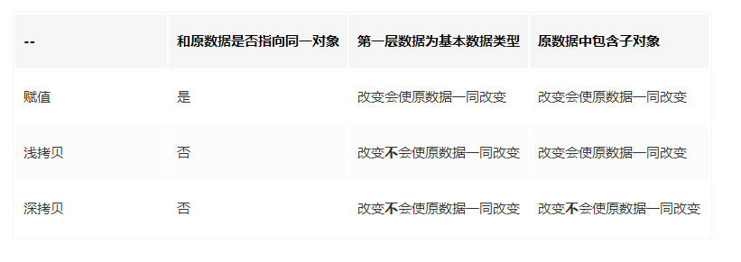

#### 浅拷贝和深拷贝与赋值的区别

#### 栈和堆的区别
- 栈自动分配内存空间，由系统释放；堆时动态分配内存，大小不定也不会自动释放。
- 基本数据类型都存放在栈中。数据大小确定，内存空间大小可以分配，是直接按值存放的，可以直接访问。
- 引用数据类型都存放在堆中。变量实际上是一个存放在栈内的指针，这个指针指向堆内存中的地址。
#### 传值与传地址的区别
- 在进行赋值操作的时候，基本数据类型赋值是在内存中新开辟一段栈内存;而引用数据类型赋值也就是传地址。
