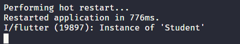
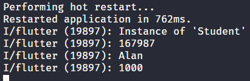

### flutter解析json(基础)
#### flutter上有许多解析数据的库，为了能够更加深入理解flutter中json的解析，所以在这里写下来记录。

#### *序列化与反序列化
##### 序列化简单来讲就是把数据写为字符串，而反序列化刚好相反，将数据重建为对象模型。一般从数据库拿到的都是json数据，所以把json数据转化为对象模型就是反序列化。

#### *整个过程
##### 1.在assets文件夹新建student.json文件，在文件写入测试数据
``` js
{
    "id":"167987",
    "name":"Alan",
    "score" : 1000
}
```
##### 2.在lib/下新建model文件夹，model/下新建student_model.dart文件,写下Student类
``` js
class Student {
  String studentId;
  String studentName;
  int studentScores;

  Student({this.studentId, this.studentName, this.studentScores});

  factory Student.fromJson(Map<String, dynamic> parsedJson) {   // 这里的factory关键字的目的是让构造函数不会一直创建类的新实例
    return Student(
        studentId: parsedJson['id'],
        studentName: parsedJson['name'],
        studentScores: parsedJson['score']);
  }
}
```
##### 3.在lib/下新建services文件夹，services/下新建student_services.dart文件，写下如下代码
```js
import 'dart:async' show Future;
import 'package:flutter/material.dart';
import 'package:flutter/services.dart' show rootBundle;
import 'package:flutter/foundation.dart';
import 'dart:convert';
import 'package:flutter_application_demo/model/student_model.dart';

Future<String> _loadAStudentAsset() async {
  return await rootBundle.loadString('assets/student.json');  //加载本地数据 
}

Future loadStudent() async {
  String jsonString = await _loadAStudentAsset();        //加载原始json字符串
  final jsonResponse = json.decode(jsonString);          //解码得到的json字符串
  Student student = new Student.fromJson(jsonResponse);  //反序列化的得到的json数据
  print(student);                                        // 打印student 显示 Instance of 'Student'
  print(student.studentId);                              // 167987
  print(student.studentName);                            // Alan
  print(student.studentScores);                          // 1000             
}
```
- 这就是在vscode中执行loadStudent()方法打印student的结果,很明显是Student实例。



- 打印所有,结果如下，json解析完成！！




